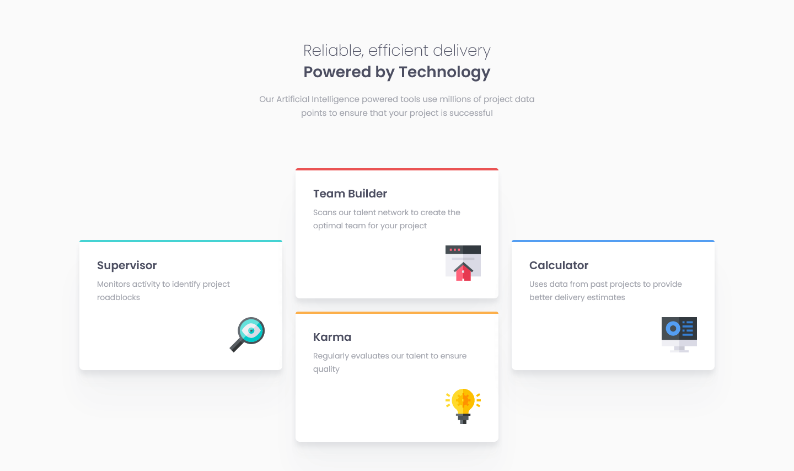
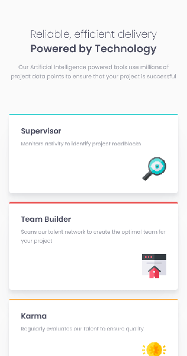

# Frontend Mentor - Four card feature section solution

This is a solution to the [Four card feature section challenge on Frontend Mentor](https://www.frontendmentor.io/challenges/four-card-feature-section-weK1eFYK). Frontend Mentor challenges help you improve your coding skills by building realistic projects.

## Table of contents

-   [Frontend Mentor - Four card feature section solution](#frontend-mentor---four-card-feature-section-solution)
    -   [Table of contents](#table-of-contents)
    -   [Overview](#overview)
        -   [The challenge](#the-challenge)
        -   [Screenshot](#screenshot)
        -   [Links](#links)
    -   [My process](#my-process)
        -   [Built with](#built-with)
        -   [What I learned](#what-i-learned)
    -   [Author](#author)
    -   [Acknowledgments](#acknowledgments)

## Overview

### The challenge

Users should be able to:

-   View the optimal layout for the site depending on their device's screen size

### Screenshot

Desktop Layout Screenshot

Mobile Layout Screenshot

### Links

-   Solution URL: [Four Card Feature on Vercel](https://fem-four-card-feature-section-zeta.vercel.app/)

## My process

### Built with

-   Semantic HTML5 markup
-   CSS custom properties
-   CSS Grid
-   Flexbox
-   Mobile-first workflow

Displaying the featured items twice. First using Grid and second using Flex.

### What I learned

I much prefer the simplicity of Grid although when I completed the challenge on my own, I used Flex. The Grid solution is far cleaner and I learnt how to use grid-template-areas to position the cards correctly in the desktop view.

## Author

-   Frontend Mentor - [@davejnicol](https://www.frontendmentor.io/profile/davejnicol)

## Acknowledgments

Thanks to [Kevin Powell](https://www.youtube.com/@KevinPowell) for all of his amazing videos. Long time viewer of his YouTube content. Saw his latest video and it reminded me of Frontend Mentor. Completed challenge before watching his YT video and adjusted my work slightly with thingst that I learnt from the video.Great watch - [Responsive layout practice for beginners](https://www.youtube.com/watch?v=JFbxl_VmIx0)
